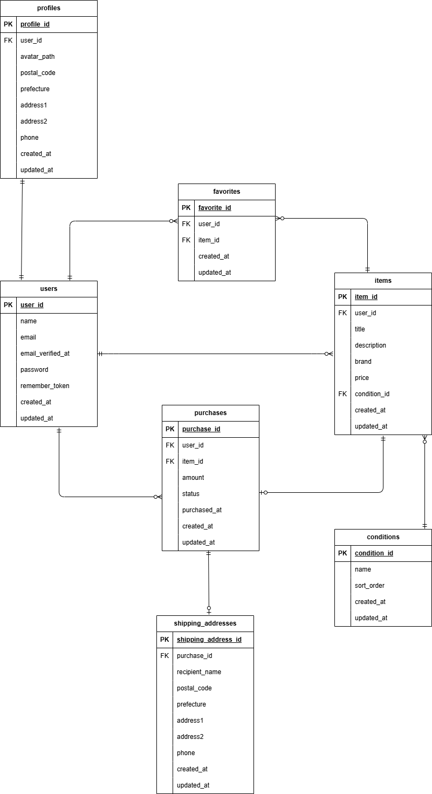

# フリマアプリ

## 環境構築

### Dockerビルド　
1. git clone git@github.com: tomoysd/coachtech-freemarket.git
2. docker-compose up -d --build 
3. mysql:
    platform: linux/x86_64
    image: mysql:8.0.26
    environment:

※ MacのM1・M2チップのPCの場合、no matching manifest for linux/arm64/v8 in the manifest list entriesのメッセージが表示されビルドができないことがあります。 エラーが発生する場合は、docker-compose.ymlファイルの「mysql」内に「platform」の項目を追加で記載してください

### Laravel環境構築 
1. docker-compose exec php bash 

2. composer install 

3. 「.env.example」ファイルを 「.env」ファイルに命名を変更。 

4. .envに以下の環境変数を追加
 DB_CONNECTION=mysql
DB_HOST=mysql
DB_PORT=3306
DB_DATABASE=laravel_db
DB_USERNAME=laravel_user
DB_PASSWORD=laravel_pass

5. アプリケーションキーの作成
php artisan key:generate

6. マイグレーションの実行
php artisan migrate

7. シーディングの実行
php artisan db:seed

8. Stripeの設定STRIPE_PUBLIC_KEY=
STRIPE_SECRET_KEY= 
※Stripeのサイトから、APIキーを取得してください

9.  アップロード画像表示のためにリンクをはる
php artisan storage:link

## 使用技術 
- PHP 8.0
- Laravel 8.83
- MySQL 8.0

## ER図

## URL 
- 開発環境: http://localhost/ 
- phpMyAdmin: http://localhost:8080/ 
- mailhog: http://localhost:8025/

